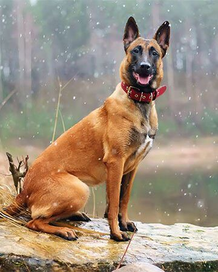

```{r setup, include=FALSE}
knitr::opts_chunk$set(echo = FALSE)
```

## Introduction

-   *Name*: T.K. Vang
-   *From*: Stevens Point, WI
-   *DOB*: 07/07/1992
-   *Program*: Master of Science in Educational Psychology
-   *Expected Graduation*: Fall 2021

## Favorite Animal
-   *My Favorite Animal*: Belgian Malinois! 



## Favorite Plot

```{r, message=FALSE, echo=FALSE}
plot(cars)
```

## CV Link

Here's the link to my ->[CV](https://github.com/stat850-unl/11-presentation-tkvang2/blob/master/resume_vangtk.12.10.2021.pdf)
